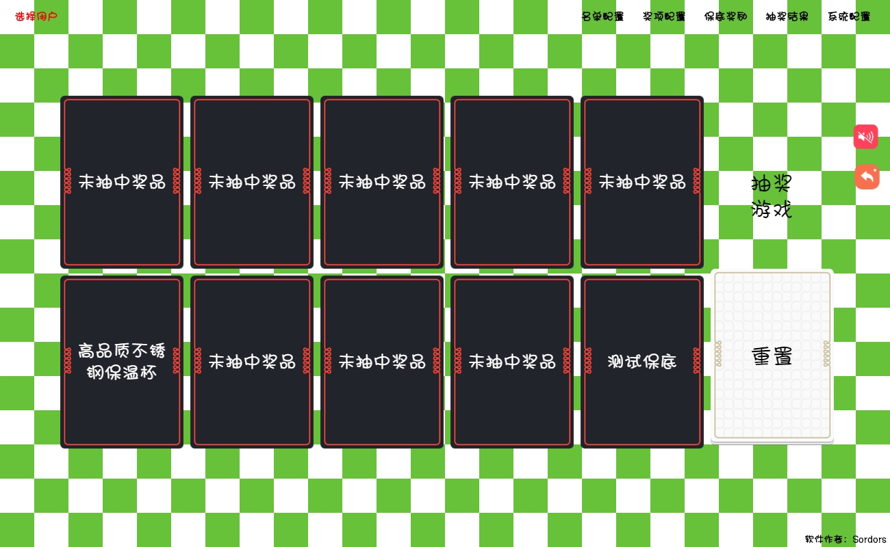

# 课堂小游戏

> 随机点名,随机抽奖，随机点名+抽奖，扭蛋抽奖，开宝箱抽奖


## 项目说明

- 受朋友之托开发的，需要在班会上给小朋友点不一样的，大概就是这个原因

- 说实话效果还不错，虽然功能简单点，但是小孩子比较好忽悠

- 配置较为简单，启动即懂，不做解释，已经有打包好的，自己下载用就好了 

- 项目使用electron-vue搭建的，用lowdb存储数据的

## 效果图





## 如何构建项目

``` bash
# install dependencies
npm install or yarn install

# serve with hot reload at localhost:9080
npm run dev or yarn run dev

# build electron application for production
npm run build or yanr build

```

## Donation

如果这个开源项目对您有帮助，请作者喝杯咖啡吧


## License

[MIT](https://choosealicense.com/licenses/mit/)