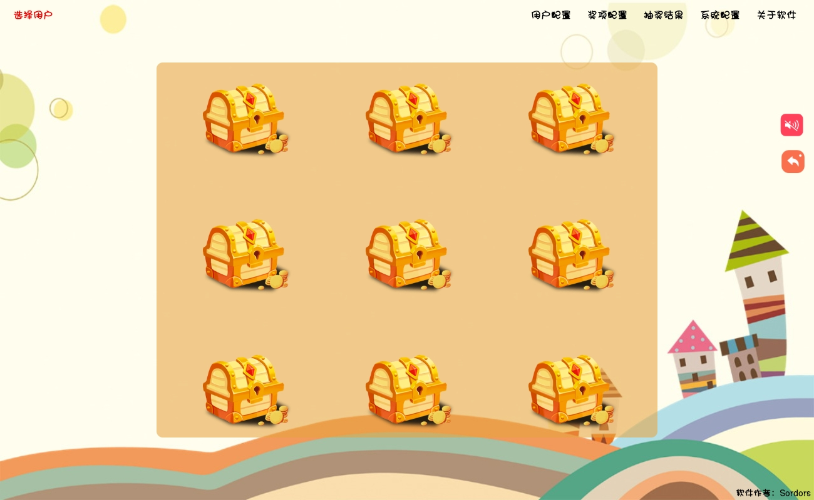
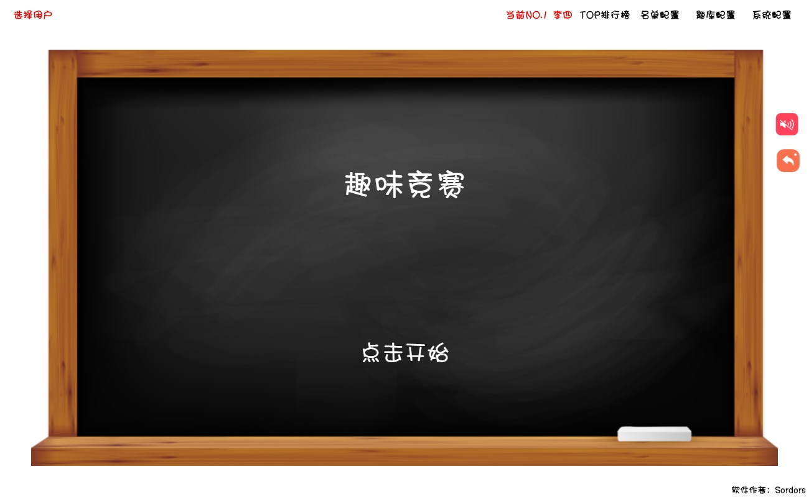

# 课堂小游戏

> 随机点名，随机抽奖，随机点名抽奖，扭蛋抽奖，开宝箱抽奖，炫酷抽奖，十连抽，趣味竞赛

## 版本说明
- 当前版本为V3.0.0，由网友赞助开发，万分感谢！！
- 该版本增加积分和十连抽的玩法以及可以指定用户
- 若未指定用户则为全局抽奖，不扣除用户积分，指定用户则扣除对应积分（积分配置都在软件系统配置内）
- 利用配置文件实现多班级，实现用户配置，奖励配置导入导出功能（如果存在多班级的情况下可使用该功能）

## 项目说明

- 受朋友之托开发的，需要在班会上给小朋友点不一样的，大概就是这个原因

- 说实话效果还不错，虽然功能简单点，但是小孩子比较好忽悠

- 配置较为简单，启动即懂，不做解释，已经有打包好的，自己下载用就好了 

- 项目使用electron-vue搭建的，用lowdb存储数据的

## 自定义背景 + 背景音乐
- 打完包的软件，可在 resources\app\dist\electron 目录下自行修改背景或者音乐
- 趣味竞赛需导入题库，打包的软件有附带，如丢失，可在doc目录下载

## 效果图








## 如何构建项目

``` bash
# install dependencies
npm install or yarn install

# serve with hot reload at localhost:9080
npm run dev or yarn run dev

# build electron application for production
npm run build:dir or yran build:dir

```

## Donation

如果这个开源项目对您有帮助，请作者喝杯咖啡吧


## License

[MIT](https://choosealicense.com/licenses/mit/)